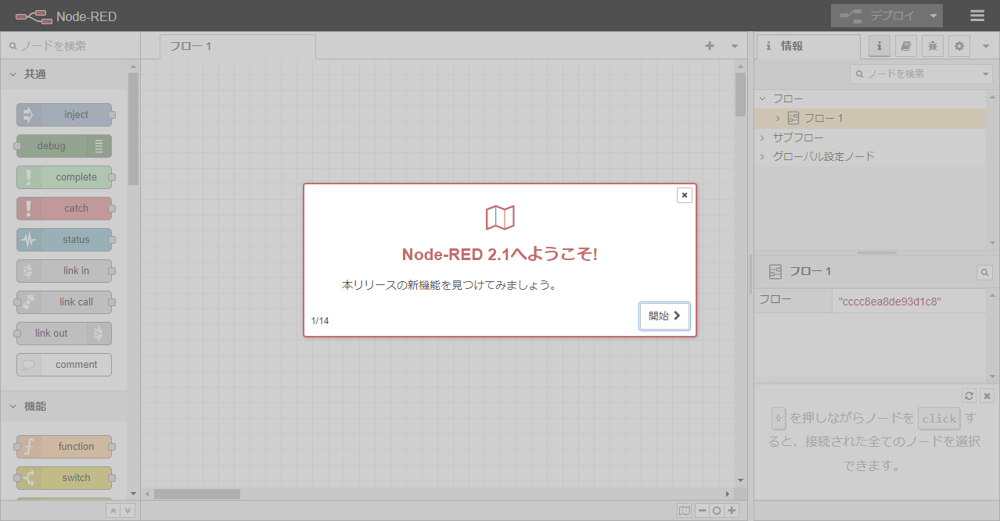

<!-- _class: title -->

# Node-RED 入門

事前準備

---
<!-- paginate: true -->

## Docker で起動

WSL の Ubuntu 上で clone して `docker-compose up -d`

```sh
$ cd
$ git clone https://github.com/mseninc/nodered-intro.git
$ cd nodered-intro
$ docker-compose up -d
```

下記のように立ち上がれば OK

```
～略～
Creating noderedintro_selenium-hub
Creating noderedintro_selenium-hub ... done
Creating noderedintro_chrome ... 
Creating noderedintro_chrome ... done
```

ブラウザーで http://localhost:1880/ にアクセス

---


