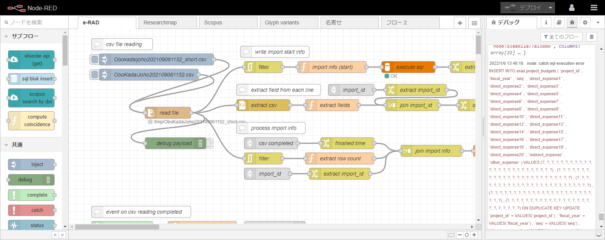
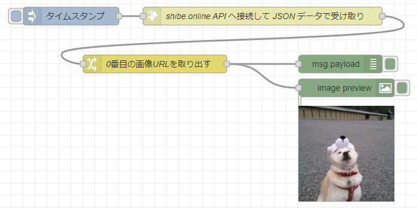
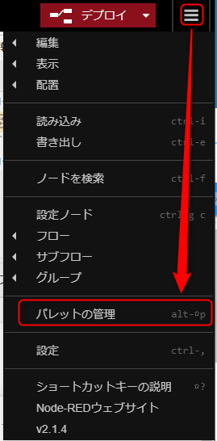
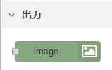

<!-- _class: title -->

# Node-RED 入門

ローコードプログラミングのススメ

---
<!-- paginate: true -->

## Node-RED

オープンソースの **フローベース・ビジュアルプログラミングツール**



---

## 早速起動してみる

clone して `docker-compose up -d`

```sh
$ cd
$ git clone https://github.com/mseninc/nodered-intro.git
$ cd nodered-intro
$ docker-compose up -d
```

下記のように立ち上がれば OK

```
～略～
Creating noderedintro_selenium-hub
Creating noderedintro_selenium-hub ... done
Creating noderedintro_chrome ... 
Creating noderedintro_chrome ... done
```

ブラウザーで http://localhost:1880/ にアクセス

---


---

## 柴犬の画像を表示してみる

[柴犬 API につないで画像を表示する仕組みを試して学ぼう 前編 | enebular blog](https://blog.enebular.com/api/shiba-inu-api-1/)



---

### モジュールの追加



1. メインメニュー → [パレットの管理]
1. [ノードを追加]
1. `image-output` を検索
1. `node-red-contrib-image-output` を [追加]

画面左のパレットに `image` ノードが追加されれば OK



---

### ノードの配置

- `inject` ノード
- `http request` ノード
- `change` ノード
- `debug` ノード
- `image` ノード
