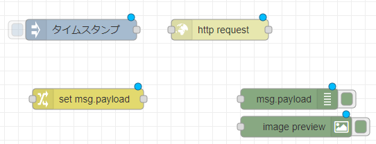
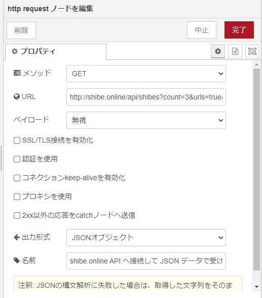
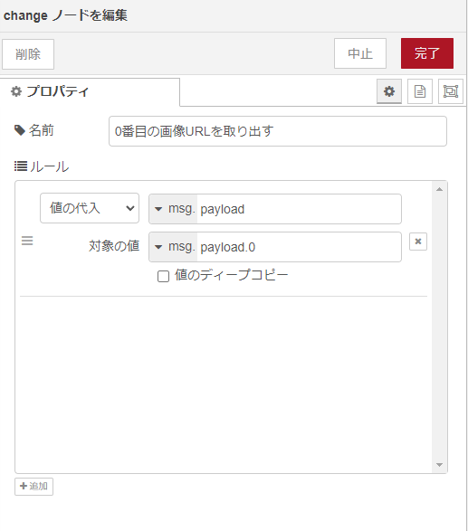
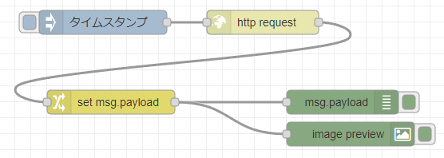
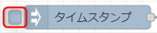

<!-- _class: title -->

# Node-RED 入門

ローコードプログラミングのススメ

---
<!-- paginate: true -->

## Node-RED

オープンソースの **フローベース・ビジュアルプログラミングツール**


---

## 早速起動してみる

clone して `docker-compose up -d`

```sh
$ cd
$ git clone https://github.com/mseninc/nodered-intro.git
$ cd nodered-intro
$ docker-compose up -d
```

下記のように立ち上がれば OK

```
～略～
Creating noderedintro_selenium-hub
Creating noderedintro_selenium-hub ... done
Creating noderedintro_chrome ... 
Creating noderedintro_chrome ... done
```

ブラウザーで http://localhost:1880/ にアクセス

---


---

## 柴犬の画像を表示してみる

[柴犬 API につないで画像を表示する仕組みを試して学ぼう 前編 | enebular blog](https://blog.enebular.com/api/shiba-inu-api-1/)


---

### モジュールの追加


1. メインメニュー → [パレットの管理]
1. [ノードを追加]
1. `image-output` を検索
1. `node-red-contrib-image-output` を [追加]

画面左のパレットに `image` ノードが追加されれば OK


---

### ノードの配置



下記のノードをおおまかに配置

- `inject` ノード
- `http request` ノード
- `change` ノード
- `debug` ノード
- `image` ノード

ノードをダブルクリックしてプロパティを編集

---

### http request ノードの設定



- メソッド: `GET`
- URL: `http://shibe.online/api/shibes?count=3&urls=true&httpsUrls=true`
- 出力形式: `JSONオブジェクト`
- 名前: 任意

---

### change ノードの設定



- ルール
    - `値の代入`: `msg.` `payload`
    - `対象の値`: `msg.` `payload.0`

イメージ 
```
payload: [
    "https://cdn.shibe.online/shibes/156e259299fcf8c648c4f6c8ce094ca1668d1504.jpg",
    "https://cdn.shibe.online/shibes/516edce738058b2c7423b32b22ce267b2cbc4011.jpg",
    "https://cdn.shibe.online/shibes/c9bd274729c07e6aa56ef83778c515414791349a.jpg"
]
```
👇 `msg.payload.0` の値を `msg.payload` に代入
```
payload: "https://cdn.shibe.online/shibes/156e259299fcf8c648c4f6c8ce094ca1668d1504.jpg"
```

---

### ノードの接続


1. ノードを下記のように接続する  

1. 
1. 
1. 🐶

