<!-- _class: title -->

# Node-RED 入門

LINE 公式アカウントの作成

---
<!-- paginate: true -->

### LINE Business ID ログイン

1. https://account.line.biz/login にアクセス
2. [QRコードログイン] で友達追加と同じ要領で QR コードを読み取る

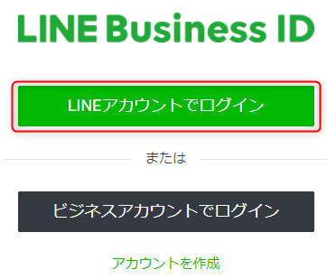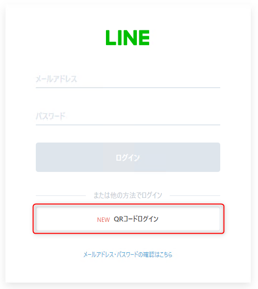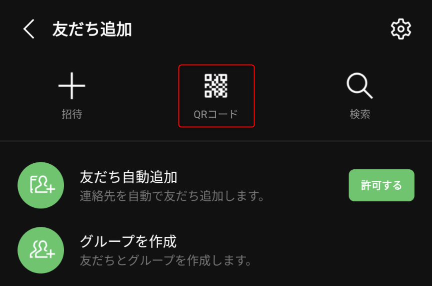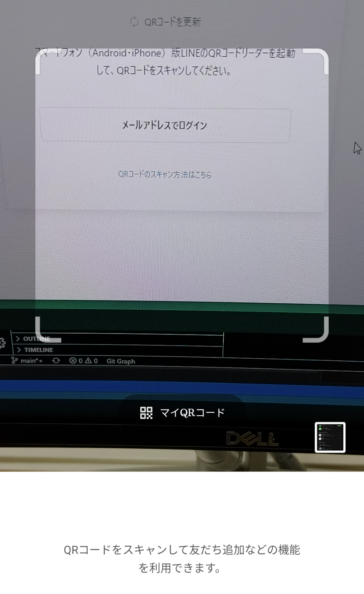

---

### LINE Business ID ログイン

3. 本人確認を行って終了

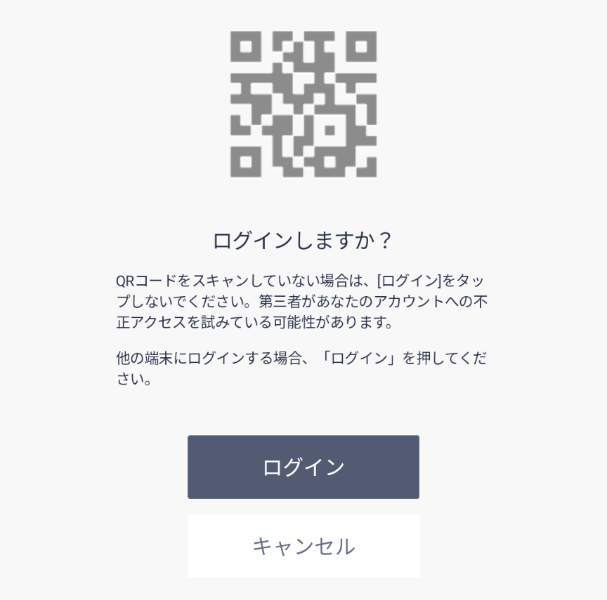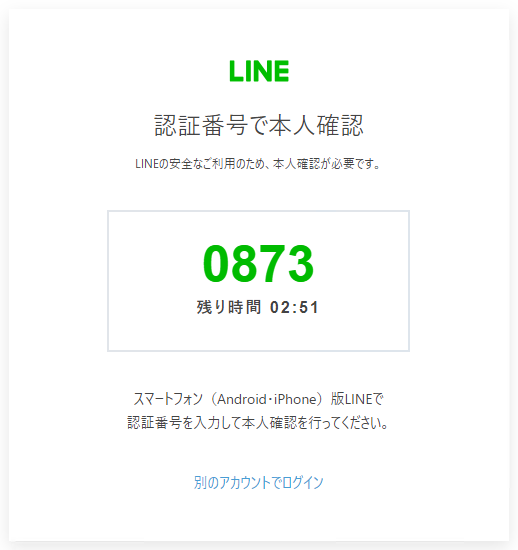

---

### 公式アカウントの作成

アカウントの作成をクリック 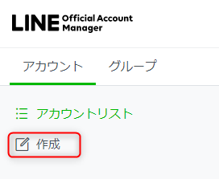

- アカウント名: `noderedbot` 👉
- メールアドレス: 自身のメールアドレス 👉
- 業種: `個人` `個人(その他)` 👉

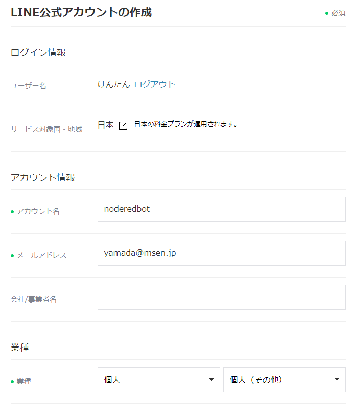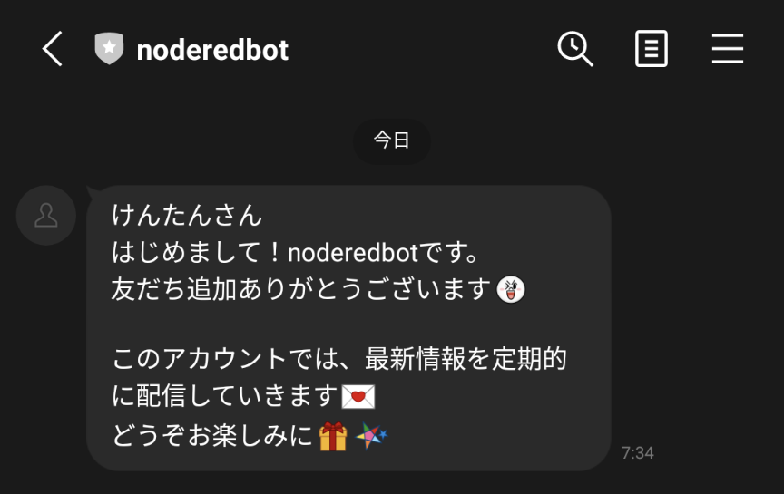

---

### 公式アカウントの作成

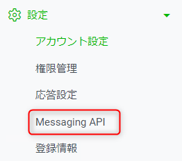

1. 画面右上の 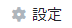 をクリック
2. [Messaging API] をクリック 👉
3.  をクリック

---

### 公式アカウントの作成

4. プロバイダー名: 自分の名前
5. プライバシーポリシー・利用規約は空で OK
6. 内容を確認して [OK]

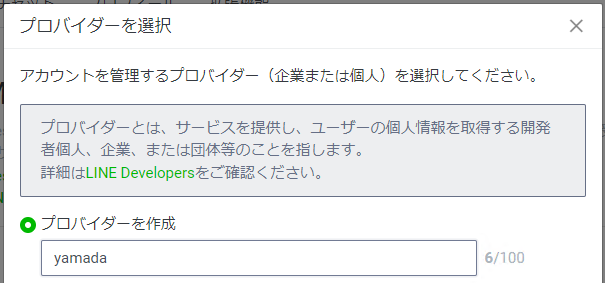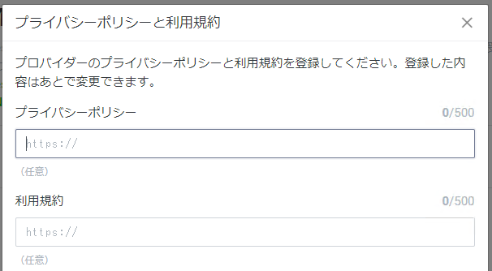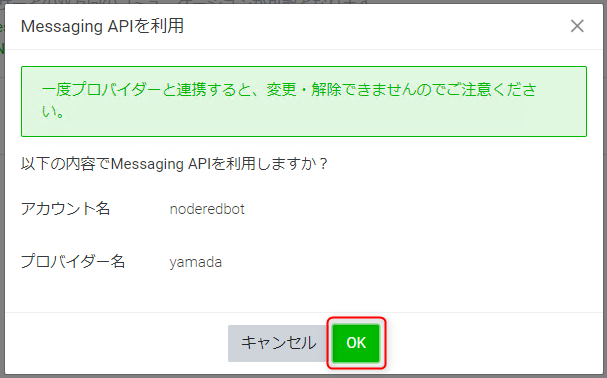

---

### 公式アカウントの作成

7. 下記のように Channel ID と Channel secret が表示されれば完了
※漏洩に注意
8. Webhook URL: `https://nodered.msen.dev/<自分の名前>/webhook` → [保存]

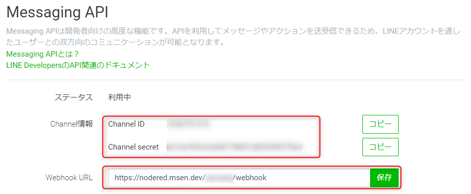

---

### 応答設定

1. 左メニューの [応答設定]
2. 応答メッセージ: `オフ`
3. Webhook: `オン`

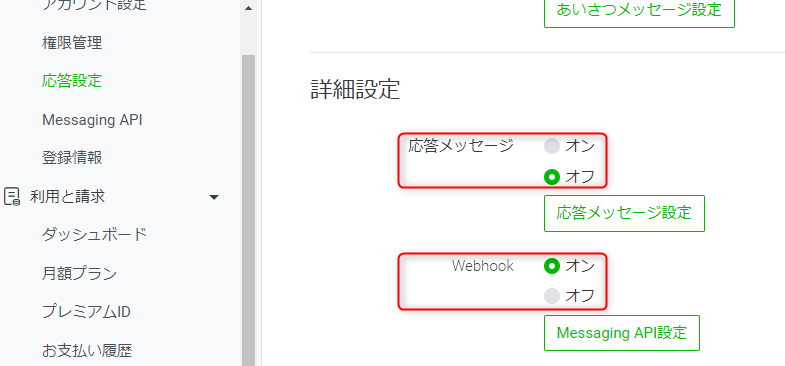
