<!-- _class: title -->

# Node-RED 入門

LINE ボットを作ってみる

---
<!-- paginate: true -->

## 事前準備

※「LINE 公式アカウントの作成」が終わっているものとします

---

## デプロイの注意

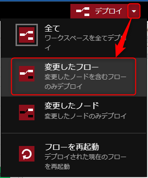

複数人で共有するため、デプロイ時に注意が必要です。

少し面倒ですが、デプロイ時は声をかけてから行ってください。

### デプロイ

初回のみ、 [デプロイ] ボタンのドロップダウンをクリックし、 [変更したフロー] を選択します。
※次回からは [デプロイ] ボタンがこの設定になります。

※デプロイ時に衝突があると言われた場合は、知らせてください。

---

### 変更のマージ

他の人が変更した場合にメッセージが表示されますので [差分を確認] をクリックします。

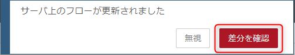

衝突がないと言われた場合はそのまま [変更をマージ] してください。
衝突がある場合は、知らせてください。

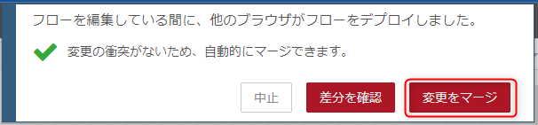

---

### デバッグ画面設定

デバッグ画面にすべてのフローのメッセージが流れてくるので [現在のフロー] に変えておくとよいでしょう

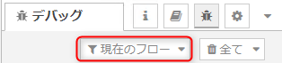


---

## 環境変数の設定

1. 自分のフローのタブをダブルクリックして、プロパティを開く
2. [環境変数] ボタンをクリック
3. 環境変数を設定
    - `LINE_CHANNEL_ID`: Channel ID
    - `LINE_CHANNEL_SECRET`: Channel secret
4. 完了

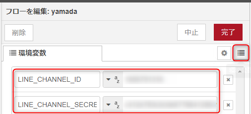

---

## アクセストークンの取得

1. yamada フローにある下記の 2 ノードをコピーして自分のフローに貼り付け
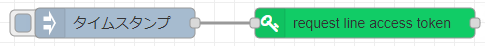
2. デプロイ
3. `inject` ノード (タイムスタンプ) を実行
4. 
    - ① デバッグ画面を開き
    - ② メッセージを展開
    - ③ 値をコピー
※ `channel_id` が自分のものか確認

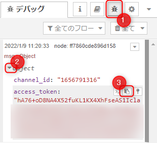

---

## アクセストークンを環境変数に追加

1. 自分のフローのタブをダブルクリックして、プロパティを開く
2. [環境変数] ボタンをクリック
3. 環境変数を追加
    - `LINE_ACCESS_TOKEN`: 取得したアクセストークン
4. 完了

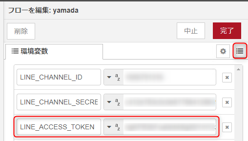

---

## Webhook の設定

1. https://nodered.msen.dev/ を開き、自分の名前のフロー（タブ）を開く
3. `http in` ノードを配置
    - メソッド: **`POST`**
    - URL: `/<自分の名前>/webhook` ※LINEで設定したもの
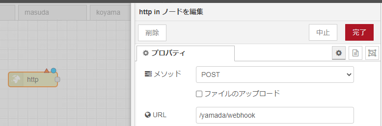

---

## Webhook の設定

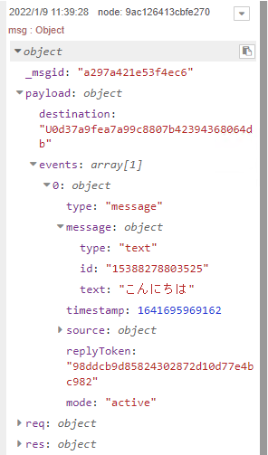

4. `http response` と `debug` ノードを配置して接続
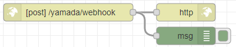
※ `debug` ノードは `msg 全体` にしておく
5. デプロイ
6. LINEアプリから公式アカウントにメッセージを送ってみる
7. デバッグ画面にメッセージが届いたら成功👍

---

## メッセージに返信する

1. `verify line signature` ノードを `http in` と `http request` の間にはさむ
2. `template` ノードと `reply line message` ノード、 `debug` ノードを追加

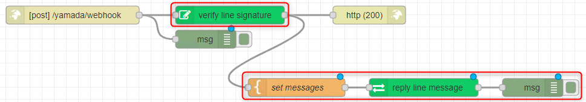

※ yamada のフローからコピペしても OK ですが、POST の URL だけ確認してください

---

## メッセージに返信する

3. `template` ノードを設定
    - プロパティ: `msg.` `messages`
    - テンプレート:
        ```json
        [
            {
                "type":"text",
                "text":"ありがとう！"
            },
            {
                "type": "sticker",
                "packageId": "8522",
                "stickerId": "16581267"
            }
        ]
        ```
    - 出力形式: `JSON`

---

## メッセージに返信する

4. デプロイ
6. LINEアプリから公式アカウントにメッセージを送ってみる
7. LINEに返信が届いたら成功👍
8. デバッグ画面は右のようになれば 👌

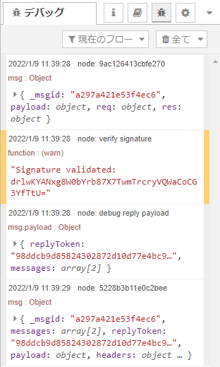

---


## ワーク

### メッセージやスタンプをいろいろ変更して返信しよう

- [送信可能なスタンプリスト | LINE Developers](https://developers.line.biz/ja/docs/messaging-api/sticker-list/#sticker-definitions)
- [メッセージオブジェクト - Messaging APIリファレンス | LINE Developers](https://developers.line.biz/ja/reference/messaging-api/#text-message)
