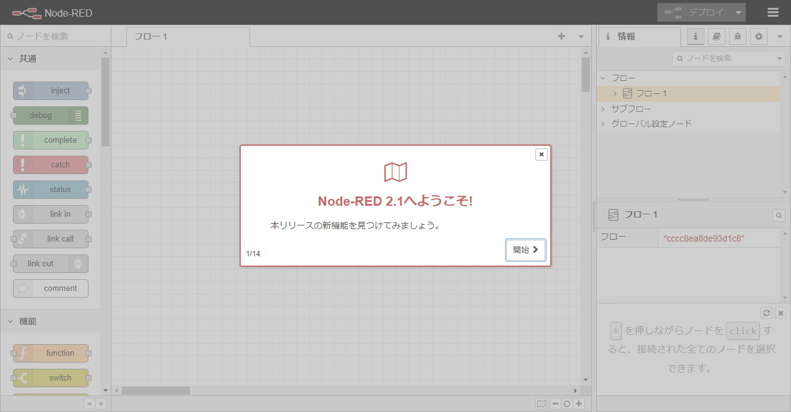
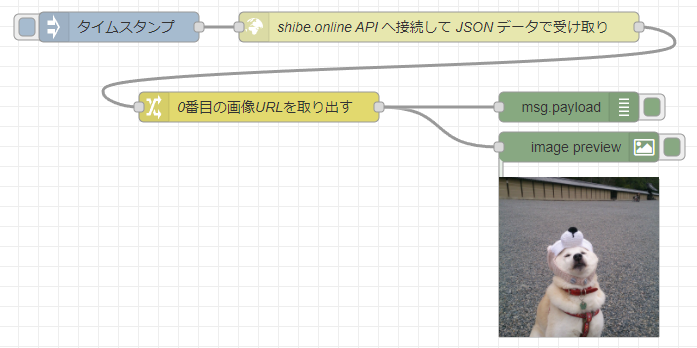
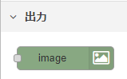
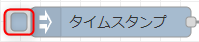
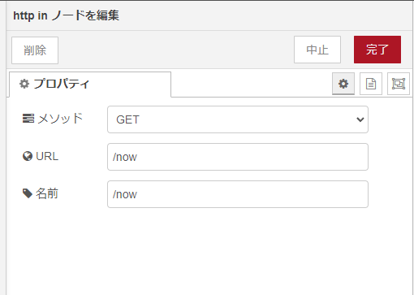
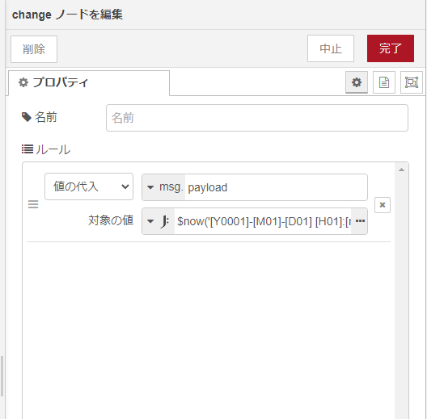
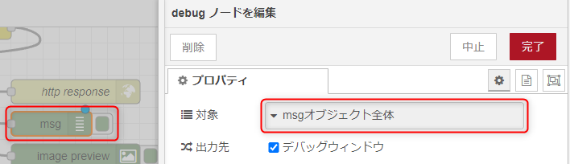
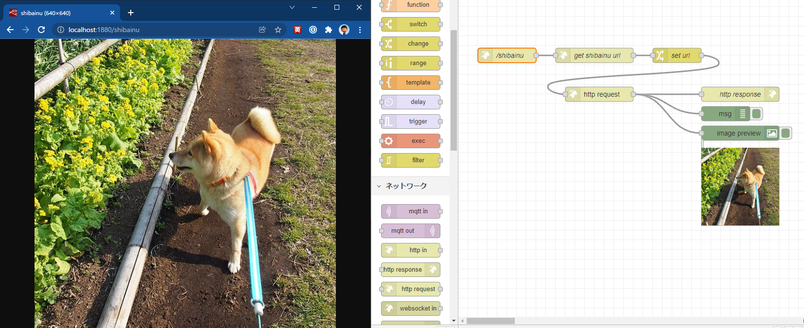

<!-- _class: title -->

# Node-RED 入門

ローコードプログラミングのススメ

---
<!-- paginate: true -->

## Node-RED

オープンソースの **フローベース・ビジュアルプログラミングツール**


---

## Docker で起動

WSL の Ubuntu 上で clone して `docker-compose up -d`

```sh
$ cd
$ git clone https://github.com/mseninc/nodered-intro.git
$ cd nodered-intro
$ docker-compose up -d
```

下記のように立ち上がれば OK

```
～略～
Creating noderedintro_selenium-hub
Creating noderedintro_selenium-hub ... done
Creating noderedintro_chrome ... 
Creating noderedintro_chrome ... done
```

ブラウザーで http://localhost:1880/ にアクセス

---



---

## 簡単な用語説明

- **ノード** : フローを構成する処理の 1 要素
- **フロー** :  
複数のノードから構成された処理の流れ。 Node-RED では 1 フロー 1 タブとなる
- **パレット**: 画面左側にあるノードのツールボックス的なもの
- **メッセージ `msg`**:  
フローを流れていく一塊のデータ。フローはこのメッセージ単位で処理される
- **ペイロード `msg.payload`**: メッセージの中でもノードで処理される対象となる主のデータ

---

## ① 柴犬の画像を表示してみる

[柴犬 API につないで画像を表示する仕組みを試して学ぼう 前編 | enebular blog](https://blog.enebular.com/api/shiba-inu-api-1/)



---

### モジュールの追加


1. メインメニュー → [パレットの管理]
1. [ノードを追加]
1. `image-output` を検索
1. `node-red-contrib-image-output` を [追加]

画面左のパレットに `image` ノードが追加されれば OK



---

### ノードの配置


下記のノードをおおまかに配置

- `inject` ノード
- `http request` ノード
- `change` ノード
- `debug` ノード
- `image` ノード

ノードをダブルクリックしてプロパティを編集

---

### http request ノードの設定


- メソッド: `GET`
- URL: `http://shibe.online/api/shibes?count=3&urls=true&httpsUrls=true`
- 出力形式: `JSONオブジェクト`
- 名前: 任意

---

### change ノードの設定


- ルール
    - タイプ: `値の代入`
    - (代入先): `msg.` `payload`
    - 対象の値: `msg.` `payload.0`

イメージ 
```
payload: [
    "https://cdn.shibe.online/shibes/156e259299fcf8c648c4f6c8ce094ca1668d1504.jpg",
    "https://cdn.shibe.online/shibes/516edce738058b2c7423b32b22ce267b2cbc4011.jpg",
    "https://cdn.shibe.online/shibes/c9bd274729c07e6aa56ef83778c515414791349a.jpg"
]
```
👇 `msg.payload.0` の値を `msg.payload` に代入
```
payload: "https://cdn.shibe.online/shibes/156e259299fcf8c648c4f6c8ce094ca1668d1504.jpg"
```

---

### ノードの接続


1. ノードを下記のように接続する  

1. 
1. 
1. 🐶

---

## ② 現在日時を返す API の作成

`http://localhost:1880/now` にアクセスすると現在日時を返す API を作ってみる


### 処理の流れ

1. `GET` `/now` を受け付ける
1. 現在日時を本文 (`payload`) に設定
1. レスポンスを返す

---

### ノードの配置

下記のノードをおおまかに配置して接続


- `http in` ノード
- `change` ノード
- `http response` ノード

---

### http in ノードの設定



- メソッド: `GET`
- URL: `/now`
- 名前: `/now`

---

### change ノードの設定



- ルール
    - タイプ: `値の代入`
    - (代入先): `msg.` `payload`
    - 対象の値: `JSONata式` `$now('[Y0001]-[M01]-[D01] [H01]:[m01]:[s01].[f01]', '+0900')	`

---

### 動作確認

1. 
1. Chrome で `http://localhost:1880/now` にアクセス


表示されない場合は `debug` ノードを配置して途中の値がどうなっているか覗いてみよう



---

## ③ 柴犬画像をプロキシする API をつくってみよう

`http://localhost:1880/shibainu` にアクセスすると **柴犬画像** を返す API を作ってみる



---

### 処理の流れ

1. `GET` `/shibainu` を受け付ける
1. 柴犬 API で柴犬画像 URL を取得
1. 最初の柴犬画像 URL を URL に設定
1. 柴犬画像を取得
1. レスポンスを返す

### ヒント

- `http request` ノードは事前に `msg.url` を設定しておくとその URL にリクエストを送る
- `http response` では `Content-Type` ヘッダーを `image/jpeg` に設定
- `http request` ノードで画像をリクエストするときは応答が画像データになるので出力形式を「バイナリバッファ」にする

---

### 使用ノード

- `http in` ノード
- `http request` ノード
- `change` ノード
- `http request` ノード
- `http response` ノード
- `image` ノード (デバッグ用)
- `debug` ノード (デバッグ用)
